 

 

  

  

---

<h3>// About</h3>
<pre>
~ ❯ whoami

██████╗ ██╗████████╗██╗██╗  ██╗ █████╗     ██╗  ██╗ █████╗ ██╗     ██╗ █████╗
██╔══██╗██║╚══██╔══╝██║██║ ██╔╝██╔══██╗    ██║ ██╔╝██╔══██╗██║     ██║██╔══██╗
██████╔╝██║   ██║   ██║█████╔╝ ███████║    █████╔╝ ███████║██║     ██║███████║
██╔══██╗██║   ██║   ██║██╔═██╗ ██╔══██║    ██╔═██╗ ██╔══██║██║     ██║██╔══██║
██║  ██║██║   ██║   ██║██║  ██╗██║  ██║    ██║  ██╗██║  ██║███████╗██║██║  ██║
╚═╝  ╚═╝╚═╝   ╚═╝   ╚═╝╚═╝  ╚═╝╚═╝  ╚═╝    ╚═╝  ╚═╝╚═╝  ╚═╝╚══════╝╚═╝╚═╝  ╚═╝
</pre>

B.E. CSE @ CCET, Chandigarh. I build AI systems that solve real problems — multilingual legal assistants, video violence detection, and privacy guardianship for XR metaverses.

<table>
<tr>
<td width="50%" valign="top">

**🧪 Research Interests**

Multilingual NLP, retrieval-augmented generation, video understanding, privacy analytics in XR, and long-term memory for conversational agents.

</td>
<td width="50%" valign="top">

**🧭 Currently**

Fine-tuning LLMs for Indic legal Q&A, and building RAG pipelines with cross-model refinement. Looking for AI/ML and full-stack roles where I can ship fast and learn faster.

</td>
</tr>
</table>

<pre>
ritika@universe:~$ whoami
AI/ML engineer · full-stack dev · researcher · ACM-W chairperson

ritika@universe:~$ cat focus.txt
Indic LLMs · RAG · VideoMAE · XR privacy · Django/Flask

ritika@universe:~$ cat mantra.txt
Build things that work. Then make them beautiful.

ritika@universe:~$ _
</pre>

<h3>// Toolkit</h3>

**Languages**

**Web Development**

**AI / ML**

**Tools & Design**

---

<h3>// Selected Work</h3>

**01 · Multilingual Legal Q&A with Cross-LLM Refinement**

`Python` `PyTorch` `QLoRA` `Qwen2.5-3B` `Flask`

Fine-tuned Qwen2.5-3B with QLoRA into 4 language adapters (English, Hindi, Punjabi, Nepali) for Indian legal Q&A. Built retrieval with BGE/LaBSE embeddings and a two-model pipeline where Qwen2.5-7B critiques and refines answers. Added an NLI entailment check to catch factual drift during refinement.

→ [**Code**](https://github.com/RitikaKalia9/Multilingual_Legal_Q-A_Cross-LLM_Hallucination_Detection-Refinement)

 

**02 · MMVDNet — Video Violence Detection**

`Python` `PyTorch` `VideoMAE` `Flask`

Fight-scene detection on a VideoMAE backbone (Kinetics-pretrained) with multi-clip sampling, achieving 96% accuracy on the RWF-2000 benchmark. Deployed as a Flask app where users can upload a video or paste a YouTube Shorts link for real-time detection.

→ [**Code**](https://github.com/RitikaKalia9/mvdnet)

 

**03 · StellerCart — Full-Stack E-Commerce**

`Django` `Python` `Bootstrap` `JavaScript`

Built a full-stack e-commerce site with Google sign-in, product listings, cart, and checkout. Designed 7 related models with Django ORM, added AJAX cart updates with CSRF protection, and integrated Razorpay (test mode) with server-side charge calculation and signature verification.

→ [**Code**](https://github.com/RitikaKalia9/Full-Stack-E-Commerce-Platform-StellerCart-)

 

**04 · Real-Time Privacy Guardianship in XR Metaverses**

`Python` `AI/ML` `Behavioral Analytics`

AI-driven behavioral analytics pipeline achieving 92% accuracy and 0.976 ROC-AUC for detecting VR privacy attacks. Published and presented as an e-Poster at IEEE ICIR 2026, University of Pisa, Italy.

→ [**Code**](https://github.com/RitikaKalia9/Real_Time_Privacy_Guardianship_in_XR_Metaverses_via_AI_Driven_Behavioral_Analytics-)

 

**05 · MusicBox**

`JavaScript` `Web`

An interactive browser-based music player built from scratch in vanilla JavaScript. Focuses on clean UI, audio controls, and playlist management without any framework.

→ [**Code**](https://github.com/RitikaKalia9/MusicBox)

---

<h3>// Research</h3>

<table>
<tr>
<td width="50%" valign="top">

**IEEE ICIR · 2026**

**Real-Time Privacy Guardianship in XR Metaverses via AI-Driven Behavioral Analytics**

- Published and presented as an e-Poster at IEEE ICIR 2026, University of Pisa, Italy. Pipeline achieved 92% accuracy and 0.976 ROC-AUC.

</td>
<td width="50%" valign="top">

**Insights2Techinfo · 2025**

**Memory in Conversational AI Agents: The Backbone of Long-Term Intelligence**

- Published in Insights2Techinfo. Explores how long-term memory shapes coherent, useful conversational agents.

</td>
</tr>
</table>

---

<h3>// Journey</h3>

| | | |
|:---|:---|:---|
| `2024 — 2027` | **B.E. Computer Science & Engineering** | Chandigarh College of Engineering & Technology |
| `2025 — 2026` | **Chairperson — ACM-W Student Chapter** | CCET, Chandigarh |
| `2025` | **Technical Team · APRATIM 2025** | CCET College Tech Fest |
| `2025` | **Design Contributor · CCET Website Team** | Figma |
| `2022 — 2024` | **Diploma in Computer Science & Engineering** | Chandigarh College of Engineering & Technology |
| `Training` | **Python Programming** | CS Soft Solutions (I) Pvt. Ltd. |

---

<h3>// LeetCode</h3>

  

<h3>// Contact</h3>

**Let's build something.**

Open to AI/ML Engineer and Full-Stack Developer roles, research collaborations, and interesting problems.

  

 

 

  

  

© 2026 Ritika Kalia · Built with ♥ 

