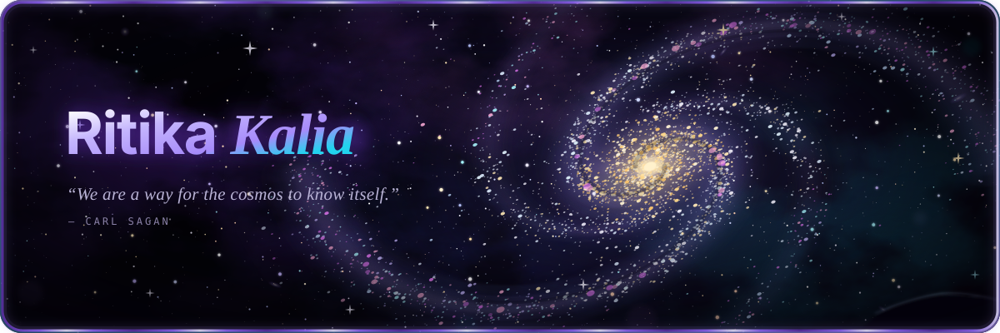

 
 

  <em>✦✦ This is my universe ✦✦</em>

 

  

  

  

 

<h3>// About</h3>
<pre>
~ ❯ whoami

██████╗ ██╗████████╗██╗██╗  ██╗ █████╗     ██╗  ██╗ █████╗ ██╗     ██╗ █████╗
██╔══██╗██║╚══██╔══╝██║██║ ██╔╝██╔══██╗    ██║ ██╔╝██╔══██╗██║     ██║██╔══██╗
██████╔╝██║   ██║   ██║█████╔╝ ███████║    █████╔╝ ███████║██║     ██║███████║
██╔══██╗██║   ██║   ██║██╔═██╗ ██╔══██║    ██╔═██╗ ██╔══██║██║     ██║██╔══██║
██║  ██║██║   ██║   ██║██║  ██╗██║  ██║    ██║  ██╗██║  ██║███████╗██║██║  ██║
╚═╝  ╚═╝╚═╝   ╚═╝   ╚═╝╚═╝  ╚═╝╚═╝  ╚═╝    ╚═╝  ╚═╝╚═╝  ╚═╝╚══════╝╚═╝╚═╝  ╚═╝
</pre>

B.E. CSE @ CCET, Chandigarh. I build systems that solve real problems~

<table>
<tr>
<td width="50%" valign="top">

**🧪 Research Interests**

Multilingual NLP, retrieval-augmented generation, video understanding, privacy analytics in XR, and long-term memory for conversational agents.

</td>
<td width="50%" valign="top">

**🧭 Currently**

Fine-tuning LLMs for Indic legal Q&A, and building RAG pipelines with cross-model refinement. Looking for AI/ML and full-stack roles where I can ship fast and learn faster.

</td>
</tr>
</table>

<pre>
ritika@universe:~$ whoami
AI/ML engineer · full-stack dev · researcher · ACM-W chairperson

ritika@universe:~$ cat focus.txt
Indic LLMs · RAG · VideoMAE · XR privacy · Django/Flask

ritika@universe:~$ cat mantra.txt
Build things that work. Then make them beautiful.

ritika@universe:~$ _
</pre>

<!-- ✨ NEW: highlights, Core Skills, Workflow -->

<table>
<tr>
<td width="33%" align="center" valign="top">

<h3>9.45 CGPA</h3>

B.E. CSE at CCET, Chandigarh (till 6th semester)

</td>
<td width="33%" align="center" valign="top">

<h3>Research</h3>

IEEE ICIR 2026 (92% accuracy, 0.976 ROC-AUC) and CMRAI 2026 (accepted)

</td>
<td width="33%" align="center" valign="top">

<h3>Built from scratch</h3>

Optimizers, autoencoders, and weight init in PyTorch, explained with Grad-CAM

</td>
</tr>
</table>

<h2 align="center">Core Skills</h2>

<table>
<tr><th align="left">Area</th><th align="left">Tools</th></tr>
<tr>
<td><b>Programming</b></td>
<td>

</td>
</tr>
<tr>
<td><b>Deep Learning</b></td>
<td>

</td>
</tr>
<tr>
<td><b>Libraries &amp; Tools</b></td>
<td>

</td>
</tr>
<tr>
<td><b>Web</b></td>
<td>

</td>
</tr>
<tr>
<td><b>Concepts</b></td>
<td>

</td>
</tr>
</table>

<h3>// Workflow</h3>

<em>From the dataset to a published result, then one experiment end to end.</em>

<!-- ✨ END NEW -->

<h3>// Projects</h3>

<table>
<tr>
<td width="50%" valign="top">

**Graph Algorithm Visualizer**

Interactive web app that visualizes BFS and DFS step by step, with synchronized Queue/Stack views, node drag-and-drop, zoom, pan, and dynamic boundary expansion. Modular ES6 architecture.

`JavaScript` `HTML` `CSS` `ES6 Modules`

</td>
<td width="50%" valign="top">

**CPU Scheduling Simulator**

Simulator for 8 scheduling algorithms (FCFS, SJF, SRTN, Round Robin, LJF, LRTN, Static/Dynamic Priority) with mixed CPU/I-O workloads, preemption, aging, Gantt charts, and metrics like waiting and turnaround time.

`Python` `Streamlit` `Matplotlib` `Pandas`

</td>
</tr>
<tr>
<td width="50%" valign="top">

**StellerCart — Full-Stack E-Commerce**

Django e-commerce platform with Google sign-in, cart, checkout, order history, AJAX cart updates with CSRF protection, and Razorpay (test mode) with server-side signature verification.

`Python` `Django` `Bootstrap` `JavaScript`

</td>
<td width="50%" valign="top">
</td>
</tr>
</table>

<h3>// Research</h3>

<table>
<tr>
<td width="50%" valign="top">

**IEEE ICIR · 2026**

**Real-Time Privacy Guardianship in XR Metaverses via AI-Driven Behavioral Analytics**

- Published and presented as an e-Poster at IEEE ICIR 2026, University of Pisa, Italy. Pipeline achieved 92% accuracy and 0.976 ROC-AUC.

</td>
<td width="50%" valign="top">

**Insights2Techinfo · 2025**

**Memory in Conversational AI Agents: The Backbone of Long-Term Intelligence**

- Published in Insights2Techinfo. Explores how long-term memory shapes coherent, useful conversational agents.

</td>
</tr>
</table>

<h3>// Journey</h3>

| | | |
|:---|:---|:---|
| `2024 — 2027` | **B.E. Computer Science & Engineering** | Chandigarh College of Engineering & Technology |
| `2025 — 2026` | **Chairperson — ACM-W Student Chapter** | CCET, Chandigarh |
| `2025` | **Technical Team · APRATIM 2025** | CCET College Tech Fest |
| `2025` | **Design Contributor · CCET Website Team** | Figma |
| `2022 — 2024` | **Diploma in Computer Science & Engineering** | Chandigarh College of Engineering & Technology |
| `Training` | **Python Programming** | CS Soft Solutions (I) Pvt. Ltd. |

<h3>// LeetCode</h3>

  

<!-- ✨ NEW: wave before Contact -->

<h3>// Contact</h3>

**Let's build something.**

Open to AI/ML Engineer and Full-Stack Developer roles, research collaborations, and interesting problems.

  

 

 

  

  

© 2026 Ritika Kalia · Built with ♥ 

